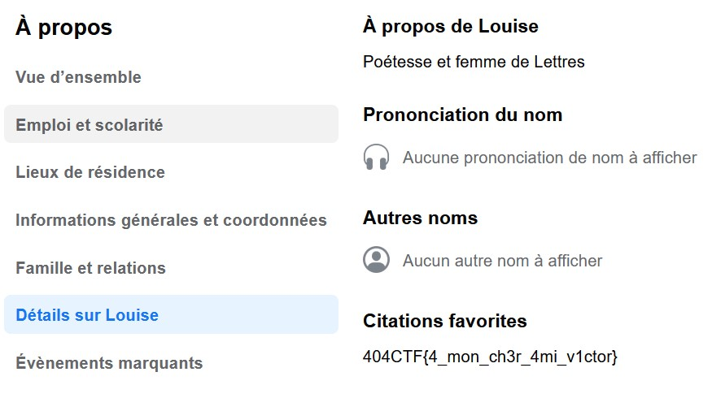

# L'âme d'un poète et le coeur d'une femme [1/4]

## Énoncé :

Une jeune femme s'approche de votre table : « Bonjour, j'ai cru comprendre que vous aviez fait vos preuves lors de précédentes enquêtes. J'aurais besoin de votre aide. Connaissez vous une certaine 'Louise Colet' ? J'ai appris qu'elle commencait à utiliser les réseaux sociaux. Pouvez vous m'aider à trouver plus d'informations sur elle ? »

En recherchant Louise Colet sur Facebook

nous tombons sur ce profil https://www.facebook.com/profile.php?id=100091643933854,

qui contient le flag dans sa description

Flag: 404CTF{4_mon_ch3r_4mi_v1ctor}
