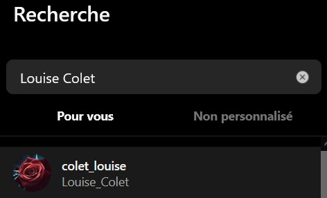
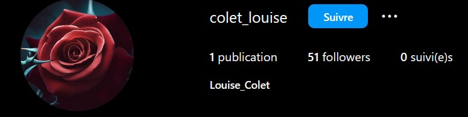

# L'âme d'un poète et le coeur d'une femme [2/4]

## Énoncé :

« Vous avez réussi à trouver toutes ces informations ? Félicitations ! Mais avez vous entendu parler de l'évènement organisé par Mme Colet ? »

Trouvez la date de l'évènement ainsi que le nom du compte qui le mentionne.

En recherchant Louise Colet sur Instagram

nous tombons sur ce profil https://www.instagram.com/colet_louise/,

ainsi que sur la date de l'événement, qui est indiqué sur la seule publication du compte

Flag: 404CTF{25_mai_colet_louise}
