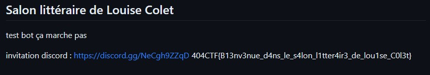

# L'âme d'un poète et le coeur d'une femme [3/4]

## Énoncé :

« C'est exactement ça ! 'Le salon littéraire de Louise Colet'. Pensez vous pouvoir me trouver une invitation ? »

Trouvez une invitation pour rejoindre le salon

En recherchant Louise Colet sur GitHub

nous tombons sur https://github.com/LouiseRevoil/Salon-litteraire-de-Louise-Colet,

ainsi que sur le flag et le lien d'invitation, qui sont dans le README

Flag: 404CTF{B13nv3nue_d4ns_le_s4lon_l1tter4ir3_de_lou1se_C0l3t}
