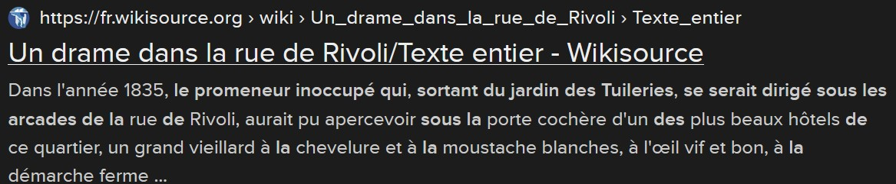

# L'âme d'un poète et le coeur d'une femme [4/4]

## Énoncé :

« Je vous remercie pour l'invitation ! Avez-vous pu vous en procurer une ? J'ai entendu dire que Mme Colet tenait ce salon pour permettre à des personnes talentueuse de se rencontrer. Je suis sûre qu'elle sera ravie de faire votre connaissance, vos talents ne sont plus à démontrer. Peut-être qu'en répondant à ses questions, vous pourrez obtenir un cadeau de sa part ? »

Obtenir un cadeau de la part de Louise Colet

La recherche : un promeneur inoccupé qui, sortant du jardin des Tuileries mène directement à ce site ainsi qu'au flag
https://fr.wikisource.org/wiki/Un_drame_dans_la_rue_de_Rivoli/Texte_entier

La recherche : "Laisse à l'homme la gloire, Les triomphes, le bruit," mène directement à ce site ainsi qu'au flag
https://fr.wikisource.org/wiki/Page:Colet_-_Historiettes_morales_-_1845.djvu/163

La recherche : Louise Colet Victor Hugo, mène vers ce site, puis au flag quelques pages plus loin 
https://gallica.bnf.fr/ark:/12148/bpt6k8572147.texteImage

Flag: 404CTF{j3_su1s_ravie_d_av0ir_fait_v0tre_connaiss4nce}
